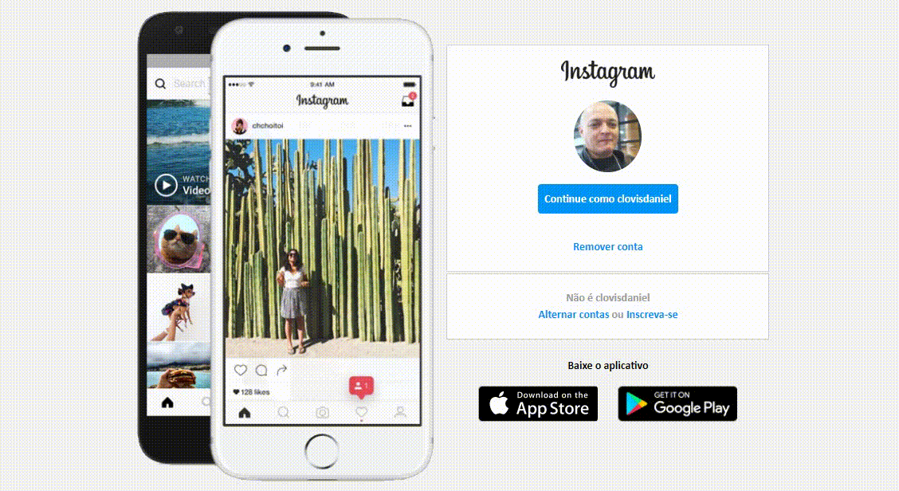

<h1 align="center">
:small_red_triangle_down: Recreating the Instagram Interface
</h1>

  

<h2 align="center">
Bootcamp everis Fullstack Developer by Digital Innovation One
</h2>

  

  

This repository was created as part of bootcamp "everis FullStack Developer" by Digital Innovation One and it's purpose is recreate the interface of Instagram to reinforce the principles of HTM5 and CSS3.

  <a href="#cloud-deploy">Deploy</a>&nbsp;&nbsp;&nbsp;|&nbsp;&nbsp;&nbsp;
  <a href="#rocket-tecnologies">Tecnologies</a>&nbsp;&nbsp;&nbsp;|&nbsp;&nbsp;&nbsp;
  <a href="#computer-instalation">Instalation</a>&nbsp;&nbsp;&nbsp;|&nbsp;&nbsp;&nbsp;
  <a href="#books-learning">Learning</a>&nbsp;&nbsp;&nbsp;|&nbsp;&nbsp;&nbsp;
  <a href="#small_orange_diamond-sharing">Sharing</a>&nbsp;&nbsp;&nbsp;|&nbsp;&nbsp;&nbsp;
  <a href="#small_orange_diamond-customizando">Customizing</a>&nbsp;&nbsp;&nbsp;|&nbsp;&nbsp;&nbsp;
  <a href="#small_orange_diamond-licença">License</a>

  

## :cloud: Deploy
  
Foi usado o servidor da AWS para o pipeline com o GitHub e o deploy da aplicação. Para testar a aplicação acesse:

- [https://](https://)

## :small_orange_diamond: License

    This project is undet MIT license. Open file [LICENSE](LICENSE.md) to details. 
    The images in this project were maded by repo's owner or taken from another repo in the web with the right authorization of use.

